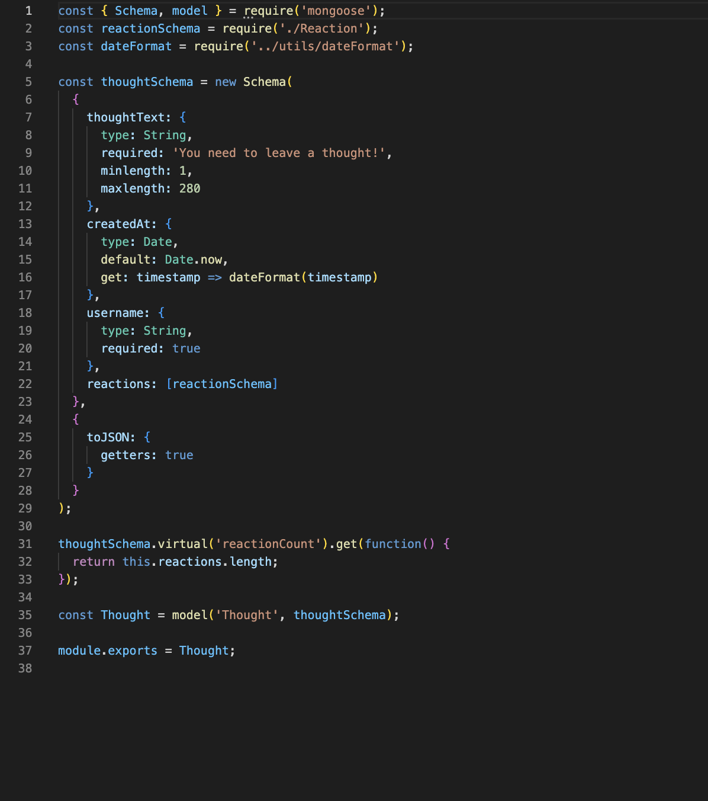
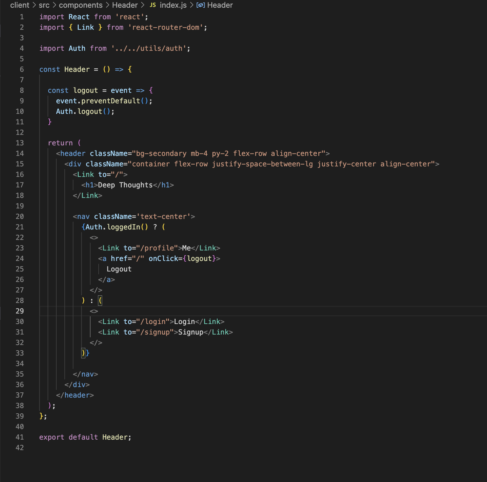
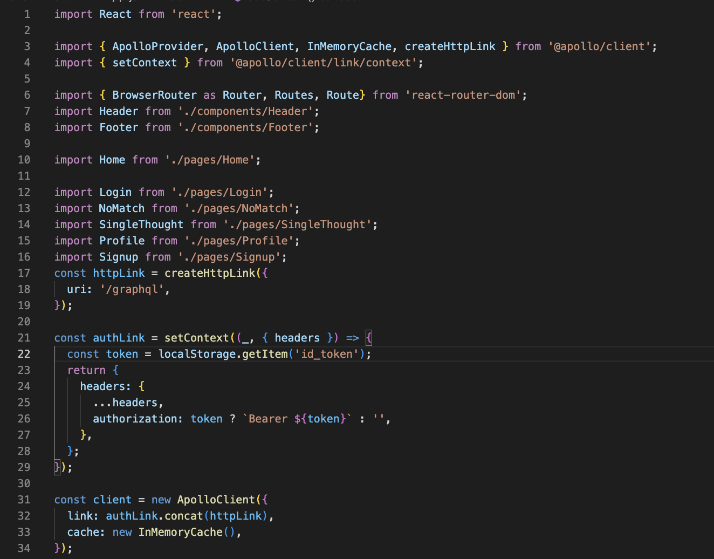
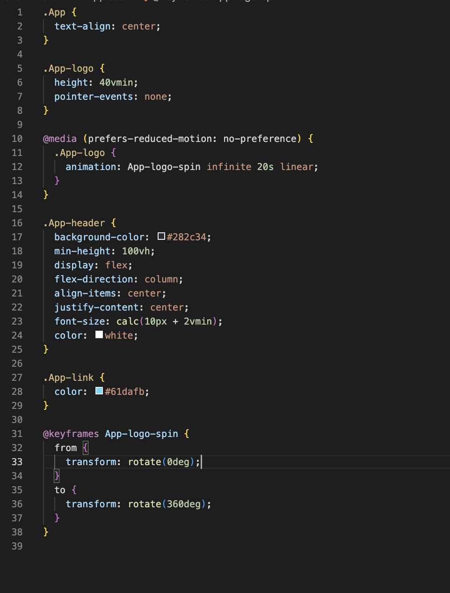
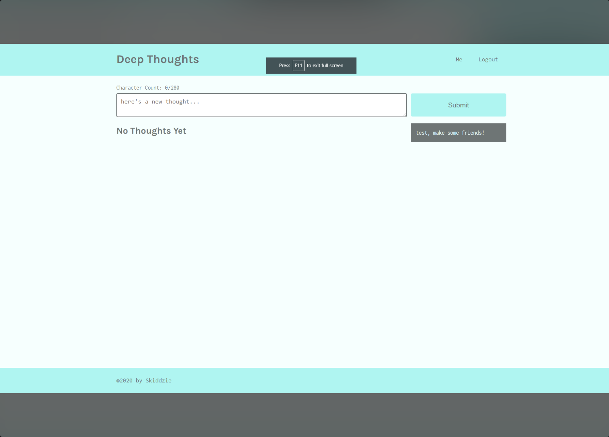

# ListenUp

- [installation](#installation)
- [usage](#usage)
- [contribution](#contribution)
- [tests](#tests)
- [links](#links)
- [preview](#preview)
 
 ## description
Welcome to ListenUp, the perfect platform for music lovers. This web application is centered on the idea of providing a socially interactive environment allowing users to connect to one another as well as get the most out of songs when it comes to song lyrics.
    
By first creating and signing in to their own accounts, users are then able to find and save lyrics for their favorite songs, share their own original lyrics which gets displayed in their profile page, as well as get connected to other users by adding each other as friends, see their friends' saved lyrics and posted personal lyrics. Both existing and own lyrics get saved and displayed on their personalized profile, allowing others to react to their posts as well as comment on them.
 
Song lyrics are found through APIs and can be saved to the user's individual database for reference.

  ## installation
- cd into the directory you want to download the application
- Clone repository using the following command and link:
   * git clone git@github.com:paulooliveira152012/ListenUp.git
- At the root directory delete package lock.json
- While still at the root directory run rpm install
- cd into client folder and delete package-lock.json
- While still at client folder run npm install
- cd .. back to the root directory and cd into the server directory and delete package-lock.json
- While still at server folder run rpm install
- Run npm start
 
 ## usage
 The application can be used to provide a social environment for users to connect to one another while searching and posting lyrics of their favorite songs, sharing their own lyrics and also reacting to other users' posts; all that through the use of a single page social media react application.
 
 ## license
 MIT
 
 ## contribution
 - Aidan McHendry (https://github.com/Skiddzie)
 - Asad Khiji (https://github.com/asad-khilji)
 - Derricka Santos (https://github.com/derrickais)
 - Joshua Ballard (https://github.com/Joshuajword)
 - Paulo Oliveira (https://github.com/paulooliveira152012)
 
 ## tests
 Not Applicable
 
## links
 
## Repository
![GitHub-repository] (https://github.com/paulooliveira152012/ListenUp)
## Deployed Application
![ListenUp] (link)
 
## preview
 
# Model example Screen-shot

 
# Component example Screen-shot

 
# App.js Screen-shot

 
# CSS Screen-shot

 
# Page example Screen-shot
